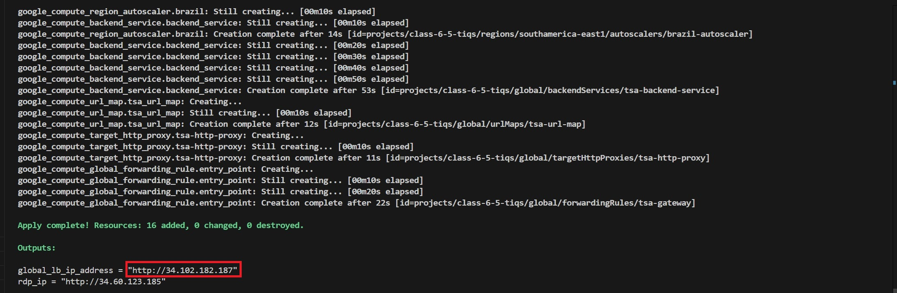
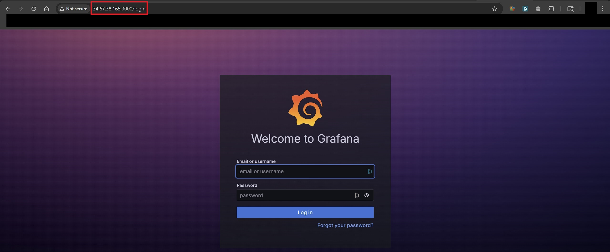
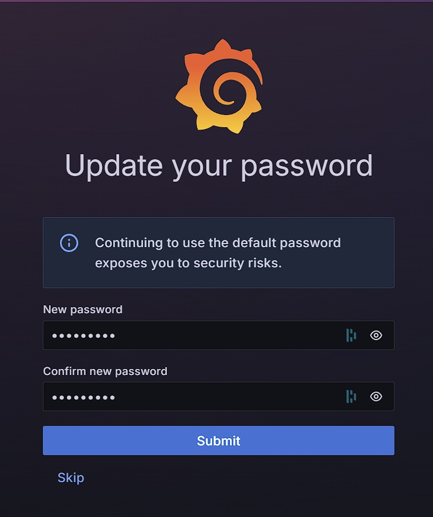
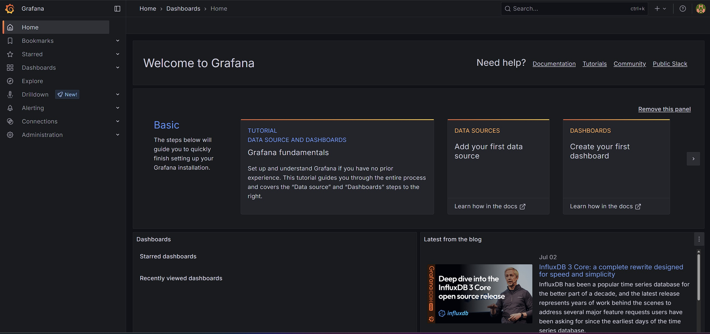
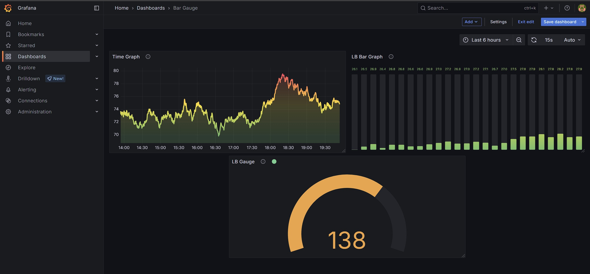

# 🚀 Be A Man Level 6: GCP Load Testing with k6 & Grafana


---

## 📎 References

- [GCP **gcloud** CLI Docs](https://cloud.google.com/sdk/gcloud)
- [Grafana OSS and Enterprise](https://grafana.com/docs/grafana/latest/)
- [Grafana k6](https://k6.io/docs/)
- [HashiCorp GCP Terraform Documentation](https://registry.terraform.io/providers/hashicorp/google/latest/)

---

## 📌 Objective Summary

Be A Man Level 6 involved deploying a scalable GCP infrastructure with a **regional managed instance group and internal load balancer**, then validating its performance using `k6` load testing and `Grafana` monitoring. The solution demonstrated successful autoscaling, efficient traffic distribution, and clear visualization of system behavior under load.

---

## 🗂 Project Structure

```plaintext
GCP-BE-A-MAN-LEVEL-6/
.
├── easy-peasy-k6-tests/
│   ├── 001-small.js
│   ├── 002-medium.js
│   ├── 003-large.js
│   └── README.md
│
├── terraform/
│   ├── 0-authentication.tf
│   ├── 1-provider.tf
│   ├── 2-variables.tf
│   ├── 3-vpc.tf
│   ├── 4-subnets.tf
│   ├── 5-firewalls.tf
│   ├── 6-vm-instances.tf
│   ├── 7-instance-template.tf
│   ├── 8-mig.tf
│   ├── 9-health-checks.tf
│   ├── 10-autoscale-policy.tf
│   ├── 11-lb.tf
│   └── 12-outputs.tf
│
├── Screenshots/
│   ├── 1-k6-run-scripts-js-up-and-down-stages.jpg
│   ├── 1-k6-run-scripts-js-with-javascript-code.jpg
│   ├── 1-k6-run-scripts-js.jpg
│   ├── 1-k6-run-vus-10-duration-30.jpg
│   ├── beron-001-small-js.jpg
│   ├── beron-002-medium-js.jpg
│   ├── brazil1.jpg
│   ├── brazil2.jpg
│   ├── brazil3.jpg
│   ├── curl-load-balancer-ip1.jpg
│   ├── curl-load-balancer-ip2.jpg
│   ├── firewall-rules.jpg
│   ├── gcloud-compute-firewall-rules-allow-grafana-http.jpg
│   ├── gcloud-compute-instance-grafana-vm.jpg
│   ├── gcloud-compute-instances-describe-grafana-vm.jpg
│   ├── gcloud-compute-ssh-confirm.jpg
│   ├── gcloud-compute-ssh-popup.jpg
│   ├── grafana-homepage.jpg
│   ├── grafana-login-screen.jpg
│   ├── grafana-update-password1.jpg
│   ├── grafana-update-password2.jpg
│   ├── grafana-visualization.jpg
│   ├── load-balancer-summary.jpg
│   ├── ssh-sudo-apt-get-install-grafana.jpg
│   ├── ssh-sudo-apt-get-install.jpg
│   ├── ssh-sudo-apt-get-update.jpg
│   ├── ssh-sudo-apt-get-update2.jpg
│   ├── ssh-systemctl-enable-start-grafana-server.jpg
│   ├── ssh-wget-q-0-grafana.jpg
│   ├── terraform-apply.jpg
│   ├── terraform-autoscaler.jpg
│   └── vm-instances.jpg
│
├── brazil.sh
├── class-6-5-tiqs-*.json
├── GUIDE.md
├── README.md
└── REPORT.md
```

---

## 📂 Terraform File Descriptions

| File                       | Purpose                                                                                               |
| -------------------------- | ----------------------------------------------------------------------------------------------------- |
| **`0-authentication.tf`**    | Sets up service account or application default credentials for GCP access.                            |
| **`1-provider.tf`**          | Defines the GCP provider, region, and project block.                                                  |
| **`2-variables.tf`**         | Contains reusable variables like region, machine type, network name, etc.                             |
| **`3-vpc.tf`**               | Creates the custom VPC (`bam6-vpc`) used for all networking.                                          |
| **`4-subnets.tf`**           | Defines public and private subnets in multiple regions.                                               |
| **`5-firewalls.tf`**         | Firewall rules: RDP, SSH, HTTP, internal traffic, Grafana port 3000, and health checks.               |
| **`6-vm-instances.tf`**      | Windows or Linux VMs, possibly including the initial Apache server or RDP jump box.                   |
| **`7-instance-template.tf`** | Defines a template used by MIGs (e.g., Debian-based Apache servers).                                  |
| **`8-mig.tf`**               | Configures a **regional Managed Instance Group (MIG)** across 3 zones.                                |
| **`9-health-checks.tf`**     | HTTP health checks used by the load balancer for backend validation.                                  |
| **`10-autoscale-policy.tf`** | Autoscaler resource for the MIG, scaling based on CPU utilization.                                    |
| **`11-lb.tf`**               | Configures the external or internal load balancer (backend service, URL map, proxy, forwarding rule). |
| **`12-outputs.tf`**          | Outputs key infrastructure values like Grafana External IP, internal LB IP, MIG size, etc.                         |

---

## 🔧 Terraform Deployment Steps

```bash
terraform init
terraform validate
terraform fmt
terraform plan
terraform apply -auto-approve
```

> Extract the Load Balancer's IP:
  
  

---

## 🖼️ Load Balancer Summary

- **VM Instance (Zone A):**
    

- **VM Instance (Zone B):**
    

- **VM Instance (Zone C):**
    

This provisions:

- VPC, subnets, firewall rues
- Linux VM Instances via Instance Template
- MIG with autoscaler and Autoscale Policies
- Load balancer and tags using Health Checks

---

## 📊 Grafana Dashboard Setup

### VM Instance Deployment _(if not deployed in Terraform)_

```bash
gcloud compute instances create grafana-vm \
  --zone=us-central1-a \ 
  --machine-type=e2-micro \ 
  --image-family=ubuntu-2204-lts \
  --image-project=ubuntu-os-cloud \
  --tags=grafana,http-server
```

### Install Grafana _(if not included in `grafana-vm` instance)_

```bash
sudo apt update
sudo apt install -y apt-transport-https wget

wget -q -O - https://packages.grafana.com/gpg.key | sudo apt-key add -
echo "deb https://packages.grafana.com/oss/deb stable main" | sudo tee /etc/apt/sources.list.d/grafana.list

sudo apt update
sudo apt install grafana -y
sudo systemctl enable grafana-server
sudo systemctl start grafana-server
```

### Grafana Login Information

```yaml
Credentials:
Grafana URL: http://<EXTERNAL IP>:3000

Username: admin
Password: admin           # Password change required after login)
```

---

## 📸 Grafana Dashboard

- **Grafana Login Screen:**

  

- **Grafana Update Password:**

  

- **Grafana Homepage:**

  

- **Grafana Visualization:**

  

---

## 🛠️ Troubleshooting

| Issue | Resolution |
|-------|------------|
| LB unhealthy | Allow GCP health check IPs |
| Grafana inaccessible | Open port 3000 + check service |
| SSH/RDP fails | Ensure firewall & external IP |
| 100% failure in k6 | Verify web app is reachable |

---

## ✅ Summary

- Deployed scalable GCP infra with **Terraform**
- Ran `k6` load tests against load-balanced web app
- Visualized metrics in `Grafana`
- Full automation, screenshots, and reporting delivered

---

## ✍️ Authors & Acknowledgments

- **Author:** T.I.Q.S.
- **Group Leader:** John Sweeney

### 🙏 Inspiration

This project was built with inspiration, mentorship, and guidance from:

- Sensei **"Darth Malgus" Theo**
- Lord **Beron**
- Sir **Rob**
- Jedi Master **Derrick**

---
